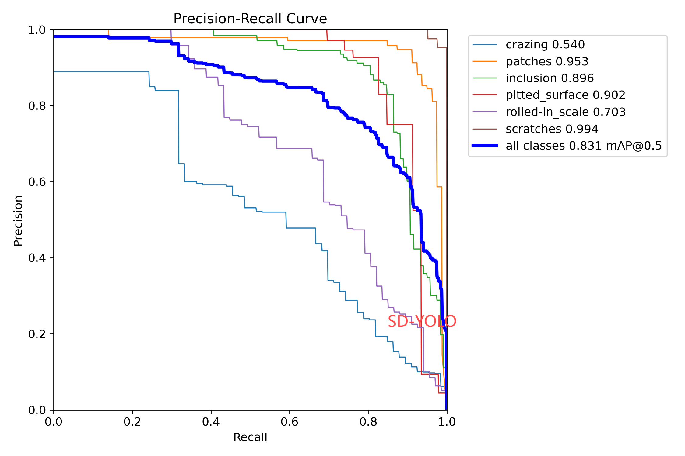
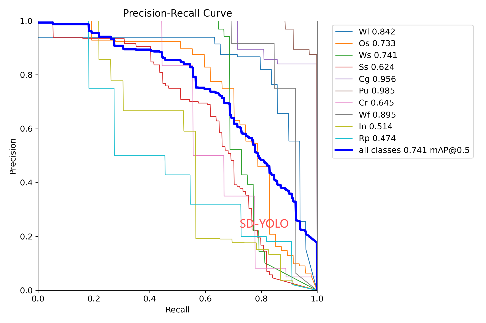

# SD-YOLO: A lightweight steel surface defect detection model with dynamic parameterisation for adaptive feature modulation
## Introduction
Here is the paper we publish "SD-YOLO: A lightweight steel surface defect detection model with dynamic parameterisation for adaptive feature modulation".

## 🚀 Training
DPEM is in nn\extra modules\block.py

## :trophy: Result
Our proposed method achieves better performance on NEU-DET and GC10-DET.

## Cite
Welcome to quote our articles.

🔗🔗Paper link：https://journals.sagepub.com/doi/abs/10.1177/03019233241293880

Li X, Xu C, Li J, et al. SD-YOLO: A lightweight steel surface defect detection model with dynamic parameterisation for adaptive feature modulation[J]. Ironmaking & Steelmaking, 2024: 03019233241293880.

@article{li2024sd,
  title={SD-YOLO: A lightweight steel surface defect detection model with dynamic parameterisation for adaptive feature modulation},
  author={Li, Xianguo and Xu, Changyu and Li, Jie and Li, Yang and Zhou, Xinyi},
  journal={Ironmaking \& Steelmaking},
  pages={03019233241293880},
  year={2024},
  publisher={SAGE Publications Sage UK: London, England}
}
